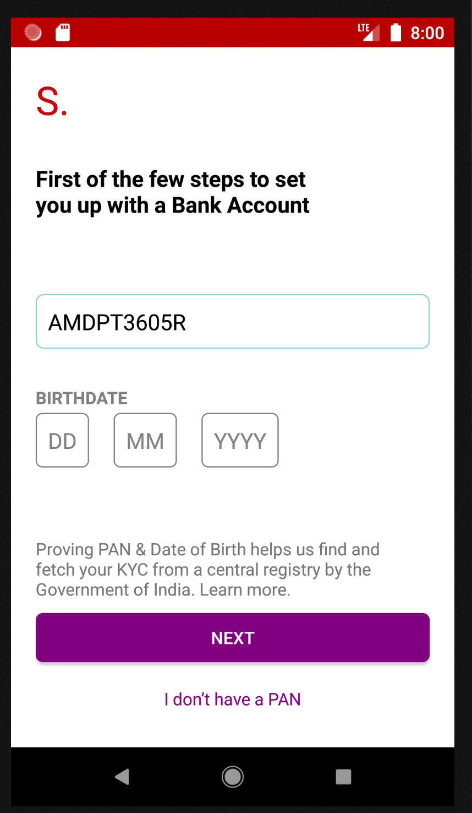
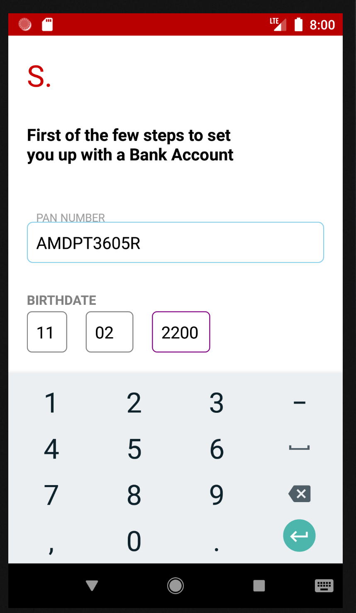
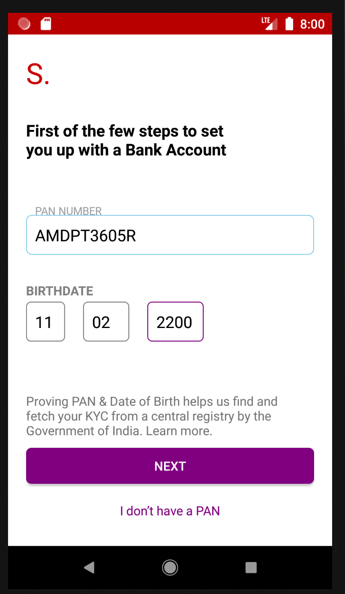

# Bank Registration

## App Description:
This app help to validate user enter PAN Card Number and birth of date.

## Technical Description:
*	The app is structured in MVVM.
*   App uses PAN Verification API to validate user enter PAN Number.
*	To be able to use this API.
  Visit: https://developers.eko.in/reference#pan-verification
*	I have used databinding to write declarative layouts
*	I have used Dagger2 to inject dependencies in userslisting module.
*	I have used 3rd party libraries like RxJava/RxAndroid 2, Dagger2,and Retrofit2.
*	you can download an apk file for the app here

## App Snapshot:

